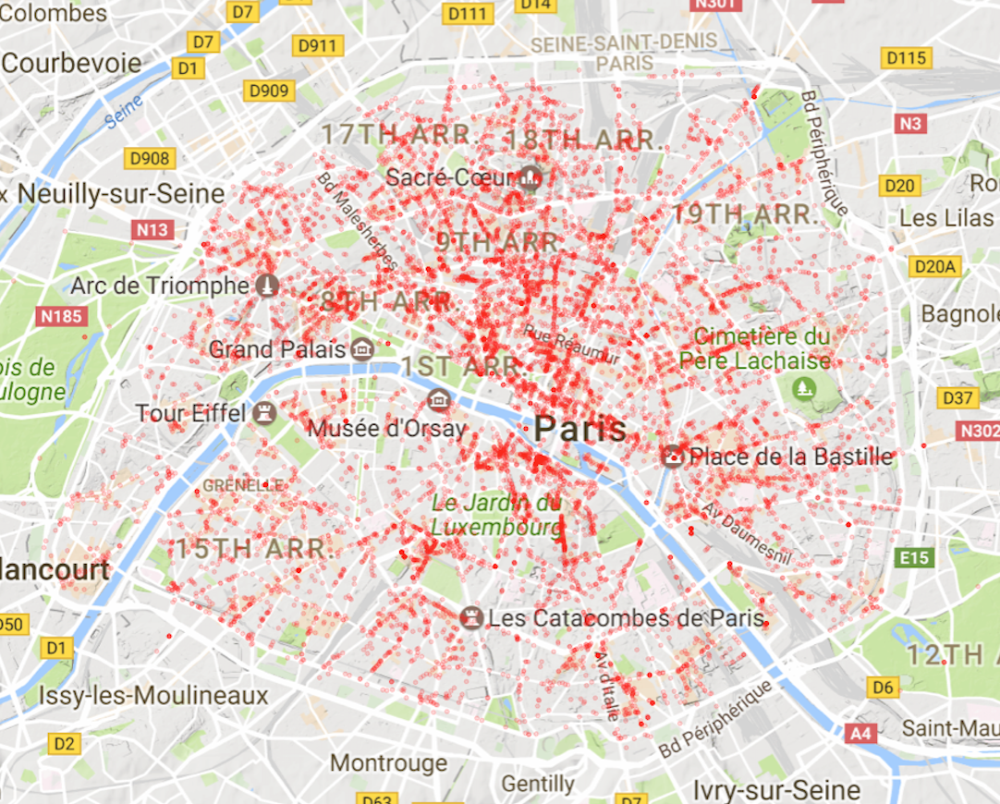

### Map of Paris Restaurants



Made with R using **ggplot2** and **ggmap**  

Using a [public dataset](https://opendata.paris.fr/explore/dataset/commercesparis/) and selecting only the following categories yields 11457 restaurants.

```
"Autre restaurant du monde"                                        
"Brasserie - Restauration continue sans tabac"  
"Restaurant africain"                                                        
"Restaurant antillais"                                                       
"Restaurant asiatique"                                                       
"Restaurant central et sud américain"                                        
"Restaurant européen"                                                        
"Restaurant indien, pakistanais et Moyen Orient"                             
"Restaurant maghrébin"                                                       
"Restaurant traditionnel français"                                           
"Restauration rapide assise"                                                 
"Restauration rapide debout" 
```